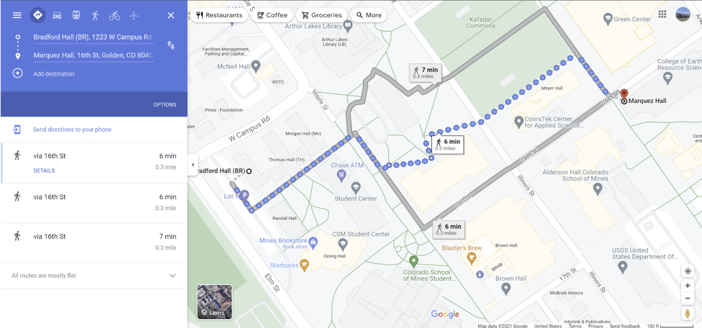
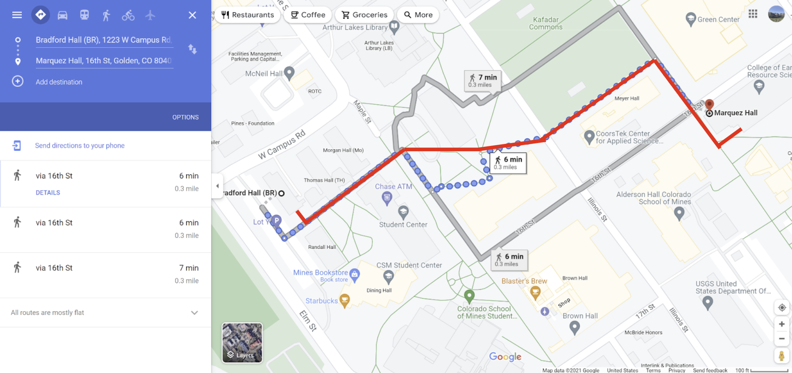

# Routes Around Campus
A simple implementation of Dijkstra's algorithm to find the most efficient routes around campus. This was made for a Introduction to Computer Science (CSCI101) Final Project I did during Fall 2021. While an implementation of Dijkstra's algorithm was definitely not expected of us, I wanted to try my hand at implementing an algorithm that can have use in real life.

# Running The Program
In order to run the program, an example file ("campus.txt") and query (see below) are provided. The program will expect an input file, walking speed (decimal number), and start/end locations (strings). The following is an example test case.

    python routes_around_campus.py
    campus.txt
    3
    Bradford
    MZ
This will result in the following output:

    The most efficient distance to MZ is 0.284mi (1498.0ft)!
    It would take you approximately 5.674 minutes to walk there.
    You should take the following path: Bradford -> Int2 -> Int9 -> Int10 -> Int11 -> Int13 -> MZ

(note that "Int" is an abbreviation for "intersection")

The following image shows the Google Maps Directions recommended route.

This image shows an estimation of what the program's route looks like.

# Assumptions & Points of Error
Assumptions had to be made in order to simplify the project so that it could be done in a reasonable timeframe. The project assumes the end user does the following:
-   End-users walk on actual paths (i.e. no cuts through commons or other grassy or non-concrete/brick areas).
-   End-users do not cut through buildings.
-  The end user is walking and is not using any vehicle.

A few points of error likely occurred as well; Google Earth and human error when measuring distances may have caused some distances to be very slightly over or under their actual value. Elevation gain and the natural landscape are also things hard to account for within an algorithm which is just considering distances.
# Caveats & Improvements
Given that this was a project for an introductory computer science course, I didn't go too far into Dijkstra's algorithm. For instance, the nodes on this graph are not bidirectional, so the user can only go from start to end with parent nodes that have child nodes. This project was made with the intention to have "Bradford Hall" as the starting node, as seen in the examples.

Another difficulty when making the project was collecting the graph data. I measured within Google Earth to find distances between locations which is definitely not a good solution. A future improvement to this project could be to use OpenStreetMap or other APIs that have already collected data so that data files can be easily generated and queried.
